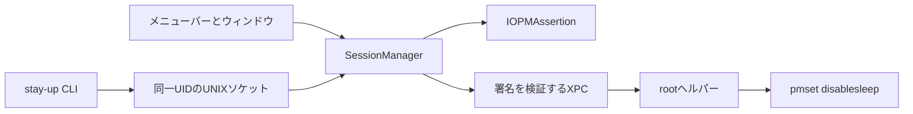

# StayUp 現状のプロダクト概要

更新日：2026年7月29日

この文書は、現在のソースコードに実装されている機能とプロダクトコンセプトをまとめたスナップショットである。
将来構想を含む詳細な設計は [`spec.md`](spec.md) を参照する。

## プロダクトコンセプト

**StayUp** は、長時間タスクが動いている間だけ Mac のスリープを抑止し、タスクが終わったら安全に通常状態へ戻す macOS 常駐アプリである。

主な利用場面は、MacBook のふたを閉じたまま、ビルド、エンコード、バックアップ、開発エージェントなどを実行し続けることである。
StayUp は特定の開発ツールを管理せず、任意のプロセスから届く「必要な間だけ起こしておいてほしい」という要求だけを扱う。

中心にある考え方は、単純なオンとオフではなく**リース**でスリープ抑止を管理することである。
リースは、要求元、表示名、期限、連動対象を持つ一件の要求である。
複数のタスクが同時にリースを持てるため、一つのタスクが終わっても、ほかのタスクが実行中ならスリープ抑止は継続する。

StayUp が目指す体験は次の三点に集約される。

- 必要なときは、メニューバーまたはウィンドウから短い操作で開始できる。
- 現在どのタスクが Mac を起こしているかを確認できる。
- 明示的な停止操作を忘れても、期限、プロセス終了、安全条件、異常終了の検知によって通常状態へ戻せる。

## 対象範囲

StayUp が現在扱うのは、次の四種類の電源管理である。

| 対象 | 実現方法 | 権限 | 現在の扱い |
| --- | --- | --- | --- |
| アイドルスリープ | `IOPMAssertion` | 一般ユーザー | リースが一件以上ある間は常に抑止する |
| ディスプレイスリープ | `IOPMAssertion` | 一般ユーザー | 設定で追加でき、既定では抑止しない |
| ディスクの省電力 | `IOPMAssertion` | 一般ユーザー | 設定で追加でき、既定では抑止しない |
| ふたを閉じたときのスリープ | `pmset -a disablesleep` | root ヘルパー | 署名済みヘルパーが承認されている場合だけ抑止する |

ディスプレイの常時点灯は既定動作ではない。
画面を消したまま処理だけを継続し、不要な消費電力を避けるためである。

StayUp はタスク自体の起動管理、リモートからの Mac の起動、Wake on LAN、特定ツールの設定ファイル編集を行わない。
現在の最小動作環境は macOS 26.0 である。

## 利用体験

### 初回設定

アプリを直接起動するとメインウィンドウを表示し、CLIからバックグラウンド起動した場合はメニューバーだけに常駐する。
ウィンドウを閉じてもアプリは終了せず、Dock から消えてメニューバー常駐へ戻る。

一般ユーザー権限だけでも、アイドルスリープの抑止は利用できる。
この状態では、MacBook のふたを閉じると通常どおりスリープする。

ふたを閉じたまま動かすには、Developer ID で署名されたビルドから root ヘルパーを登録し、macOS の「ログイン項目と機能拡張」で承認する。
登録フローでは `sudo` コマンドを実行せず、通常の利用中にも `sudo` のパスワード入力は発生しない。

### 手動で開始する

メニューバーでは「StayUpを開始」のサブメニューから30分、1時間、2時間、無期限を選ぶと、その期間で開始する。
開始後は、状態、実効範囲、バッテリー残量、実行中のセッションをネイティブメニューで確認できる。

ウィンドウの開始コントロールは、左側の再生ボタンと右側の期間メニューを一体化している。
再生ボタンは設定画面の「既定の期間」で開始し、期間メニューの各項目は選択と同時にその期間で開始する。
期間メニューのチェックは現在の既定期間を示し、今回だけ別の期間で開始しても既定値は変更しない。

グローバルショートカットは、ほかのアプリが前面にある場合も利用できる。
`⌃⌥⌘1`、`⌃⌥⌘2`、`⌃⌥⌘3`、`⌃⌥⌘4` は順に30分、1時間、2時間、無期限で開始し、`⌃⌥⌘0` はすべてのセッションを解除する。
数字キーを `⌘` だけと組み合わせると、ブラウザやエディタのタブ切替を奪うため、ControlキーとOptionキーを併用する。

各セッションのサブメニューでは、残り時間、要求元、連動対象を確認し、手動セッションを30分、1時間、2時間ずつ延長できる。
「すべて解除」は手動セッションと外部クライアントのセッションをまとめて終了する。

### ウィンドウで管理する

メインウィンドウは `NavigationSplitView` によるサイドバーとコンテンツの二領域で構成される。
全体に作用する期間メニュー付き開始と、すべて解除は標準ツールバーに置かれ、macOS 26 の Liquid Glass 表現をシステムに任せている。

サイドバーから次の画面へ移動できる。

| 画面 | 現在できること |
| --- | --- |
| 概要 | 抑止状態、実効範囲、電源状態、安全な自動解除条件、最大五件のセッション、警告を確認する |
| セッション | 有効なリースを一覧し、開始時刻、残り時間、連動対象、更新回数を確認して、選択したリースを解除する |
| 履歴 | 開始、解除、自動解除、抑止の開始と終了、ヘルパーエラー、残留検出の最新300件を確認する |
| 連携 | 外部クライアントの承認方針、クライアントごとの同時リース上限、承認済みクライアントを管理する |
| 設定 | 既定期間、残り時間表示、抑止範囲、自動解除条件、履歴保持期間を変更する |
| 診断 | ヘルパー状態と `pmset` の現在値を確認し、必要なら緊急復元を実行する |

概要画面は、日常的に必要な状態確認へ情報を絞っている。
設定画面で変更する「安全な自動解除」は、概要画面では現在の有効条件だけを要約して表示する。

### CLI から利用する

同梱の `stay-up` CLI は、アプリと同じユーザーの UNIX ドメインソケットを通じてリースを操作する。
`acquire`、`run`、引数なしのトグル、`doctor` は、アプリが停止していればバックグラウンドで起動して最大5秒待つ。

最も安全な利用方法は、実行したいコマンドを `run` で包むことである。

```sh
stay-up run --owner build -- make release
```

この方法では `stay-up` プロセスの PID とリースが連動する。
コマンドの正常終了だけでなく、親プロセスの異常終了や強制終了もリース解放の契機になる。

開始と終了を個別に扱う場合は、リースIDを使用する。

```sh
lease_id=$(stay-up acquire --owner pipeline --ttl 30m)
stay-up renew "$lease_id" --owner pipeline --ttl 30m
stay-up release "$lease_id" --owner pipeline
```

プロセスやリースファイルへの連動も指定できる。

```sh
stay-up acquire --owner pipeline --bind-pid $$ --ttl 2h

stay-up acquire \
  --owner encoder \
  --lease-file ./.stay-up-lease \
  --if-not-exists \
  --ttl 30m
```

現在提供している主なコマンドは次のとおりである。

| コマンド | 動作 |
| --- | --- |
| `run` | 子コマンドの実行中だけリースを保持する |
| `acquire` | リースを取得してIDを返す |
| `renew` | IDまたはリースファイルでTTLを更新する |
| `release` | 一件のリースを解放する |
| `stop` | 全リース、または指定した所有者のリースを解放する |
| `list` | 有効なリースを一覧する |
| `status` | 全体状態、実効範囲、終了見込み、電源、警告を表示する |
| `wait` | 全リースがなくなるまで待機する |
| `doctor` | ヘルパー、`pmset`、抑止範囲を診断する |

`list`、`status`、`doctor` にはJSON出力があり、シェル、tmux、プロンプト表示などから利用できる。
旧 `awake.sh` の `start`、`stop`、`status`、`-t`、`-b` も互換入力として受け付けるが、`-b` は現在のグローバル設定を変更せず警告だけを表示する。

## リースモデル

有効なリースが一件以上ある間だけ、StayUp はスリープを抑止する。
二件目以降の取得では `pmset` を再実行せず、最後の一件がなくなったときだけ通常状態へ戻す。

リースには次の二種類がある。

- **対話的リース**：メニューバーまたはウィンドウからユーザーが開始した要求で、無期限を選択できる。
- **外部リース**：`--owner` を指定したCLIクライアントの要求で、必ずTTLが付く。

外部リースのTTLは、要求値が未指定なら30分、上限は2時間である。
更新するたびに現在時刻からTTLを取り直せるため、定期的な `renew` をハートビートとして利用できる。
一つの外部クライアント名が同時に持てるリースは既定で8件である。

CLIで `--owner` を省略した取得要求は、現在の互換動作では対話的リースとして扱われる。
更新または解除で `--owner` を指定すると、異なる所有者名のリースに対する操作を拒否する。
所有者名は省略も自己申告もできるため、認証機構ではなく、スクリプトでは一貫して `--owner` を指定するための運用上の識別子である。

リースは次の対象と連動できる。

- **PID連動**：対象プロセスが終了すると解放する。
- **プロセス名連動**：一致するプロセスがすべてなくなると解放する。
- **リースファイル連動**：指定ファイルがなくなると解放する。

PIDの終了はイベント通知で即時に検知し、すべての連動対象を1秒ごとの確認でも補完する。

## スリープ抑止の状態

アプリが表示する主な状態は次のとおりである。

| 状態 | 意味 |
| --- | --- |
| `idle` | リースがなく、通常どおりスリープする |
| `activating` | アサーションとヘルパーを有効化している |
| `active` | アイドルスリープと、ふたを閉じたときのスリープを抑止している |
| `degraded` | アイドルスリープだけを抑止しており、ふたを閉じるとスリープする |
| `deactivating` | アサーションと `disablesleep` を解除している |

`degraded` は処理失敗ではなく、一般ユーザー権限で利用できる範囲へ機能を縮小した状態である。
ヘルパーが未登録、未承認、未署名、または通信不能でも、リースの取得自体は成功させて元のタスクを止めない。

## 安全な自動解除

個別リースの終了条件と、全リースより優先されるグローバル条件を分けている。

個別リースは次の条件で解放する。

- ユーザーまたはクライアントが明示的に解除した。
- TTLが切れた。
- PID、プロセス名、リースファイルの連動対象がなくなった。

グローバル条件が成立すると、要求元にかかわらず全リースを失効させる。

- Mac がバッテリー駆動中に、残量が設定値以下になった。
- 連続したスリープ抑止時間が設定した上限に達した。
- macOS の熱状態が `critical` になった。

熱状態による解除は無効化できない。
バッテリー残量と継続時間の上限は設定画面で有効化または無効化できる。

現在の既定値は次のとおりである。

| 設定 | 既定値 |
| --- | --- |
| 手動セッションの期間 | 無期限 |
| バッテリー残量による解除 | 20%以下 |
| 連続抑止時間の上限 | 12時間 |
| ディスプレイスリープの抑止 | オフ |
| ディスク省電力の抑止 | オフ |
| メニューバーの残り時間 | 非表示 |
| 外部クライアントの方針 | 初回に確認 |
| 外部リースの既定TTL | 30分 |
| 外部リースの最大TTL | 2時間 |
| クライアントごとの上限 | 8件 |
| 履歴の保持期間 | 30日 |

## 権限と復元

`pmset disablesleep` は、実行したプロセスが終了しても値が残るシステム全体の設定である。
StayUp は、この残留を避けるために一般ユーザーのアプリと root ヘルパーを分離している。



root ヘルパーが受け付けるのは、`disablesleep` の切り替え、現在値の照会、heartbeat の三操作だけである。
任意のコマンドやパスを root で実行する入口は持たない。

Developer ID 署名がある場合、ヘルパーは同じTeam IDで署名されたStayUpアプリからの接続だけを受け付ける。
CLI用ソケットは、アプリと同じUIDの接続だけを受け付ける。

復元は次の契機で実行する。

- 最後のリースを解放した。
- アプリを正常終了した。
- アプリとのXPC接続がすべて切れた。
- 30秒間隔のheartbeatが90秒を超えて途絶えた。
- 起動時に前回のStayUp所有状態が残っていることを検出した。
- ユーザーが診断画面から緊急復元を実行した。

アプリの再起動時に、前回のリースを自動再開することはない。
状態ファイルは残留した `disablesleep` を判断して解除するために使い、古いリースを復活させない。

## 外部クライアントの承認

外部クライアント名は識別と表示に使う自己申告値であり、認証情報ではない。
初期設定では、未知の `--owner` から取得要求が来るとmacOSの確認ダイアログを表示する。

ユーザーは永続的な許可、今回だけの許可、拒否を選べる。
永続的に許可した名前は連携画面から取り消せる。
承認ダイアログへ応答できない状態では、確認が必要な要求を許可しない。

方針は次の三種類から選べる。

- **確認してから許可**：初めて見るクライアント名ごとに確認する。
- **常に許可**：外部クライアントからの取得要求を確認なしで受け付ける。
- **拒否**：外部からの新しい取得要求を拒否する。

## 履歴と診断

設定は `UserDefaults` に保存する。
現在状態は `~/Library/Application Support/StayUp/state.json` に原子的に保存する。
履歴は同じディレクトリの `history/YYYY-MM.jsonl` に追記する。

履歴は月単位で保持し、起動時に設定した保持期間より古い月次ファイルを削除する。
高頻度の `renew` は一件ずつ記録せず、最終的な解除イベントに更新回数を集約する。

診断画面と `stay-up doctor` は、ヘルパーの登録状態、`SleepDisabled` の値、現在のリース数、実効的な抑止範囲を確認する。
診断画面の緊急復元は、全リースを破棄し、一般ユーザーのアサーションとrootヘルパーの設定を解除する。

## UI設計

UIはmacOS 26の標準コンポーネントを優先し、素材、角丸、ツールバー背景を独自に再現しない。
メニューバーは `MenuBarExtra` のネイティブメニュースタイルを使い、ウィンドウのツールバーはLiquid Glassを含むシステムの外観へ追従する。

操作の配置は、利用頻度と影響範囲で分けている。

- メニューバーは、アプリを開く、現在状態、セッション、診断、設定、終了の順で構成する。
- 開始時間とセッションごとの詳細操作はサブメニューへ置き、最初の階層を短く保つ。
- ツールバーには、画面をまたいで作用する期間メニュー付き開始と、すべて解除を置く。
- サイドバーには、概要、アクティビティ、管理、診断という情報の移動だけを置く。
- 個別セッションの解除は、セッション一覧で選択した対象にだけ作用させる。
- 安全条件の変更は設定画面に集約し、概要画面には現在有効な条件だけを表示する。

状態は色だけで表さず、シンボル、ラベル、説明文を併用する。
ヘルパーが使えない場合も「オン」に見せず、「制限あり」と「ふたを閉じるとスリープする」を明示する。

## 現在の制約

次の項目は設計書に構想または設定モデルがあるが、現行アプリの動作には接続されていない。

- CPU使用率が低い状態を検知する自動解除。
- ログイン時の自動起動。
- アプリ起動と同時に手動セッションを開始する機能。
- App IntentsとShortcuts。
- グローバルホットキー。
- `stay-up://` URLスキームのイベント処理。
- コントロールセンターのコントロール。

外部リースの既定TTLと最大TTL、CLIソケットの有効化は設定モデルにあるが、現在の設定画面からは変更できない。
ヘルパー登録にはDeveloper ID署名とmacOS上の承認が必要であり、ad-hoc署名の開発ビルドはアイドルスリープ抑止だけを提供する。
ヘルパーは起動時に `SleepDisabled=1` を検出すると孤立状態として解除するため、同じ `disablesleep` を管理する別の常駐ツールとの併用は想定していない。

## 実装コンポーネント

| コンポーネント | 現在の責務 |
| --- | --- |
| `StayUpApp` | メニューバー、メインウィンドウ、承認ダイアログ、アプリの起動と終了 |
| `SessionManager` | リース台帳、状態遷移、自動解除、履歴、設定反映を一元管理する |
| `LeaseRegistry` | リースの取得、更新、延長、解放、期限切れ、所有者ごとの操作制限を扱う |
| `AssertionController` | 一般ユーザー権限のアイドル、画面、ディスクのアサーションを扱う |
| `ControlSocketServer` | 同一UIDのCLI要求を受け付けて状態管理へ渡す |
| `HelperClient` | rootヘルパーの登録状態、XPC通信、heartbeatを扱う |
| `StayUpHelper` | 固定された `pmset disablesleep` 操作と異常時の復元だけをrootで行う |
| `HistoryStore` | 月次JSONL履歴の追記、読み取り、保持期限の適用を行う |
| `StateStore` | クラッシュ復元用の状態スナップショットを原子的に保存する |
